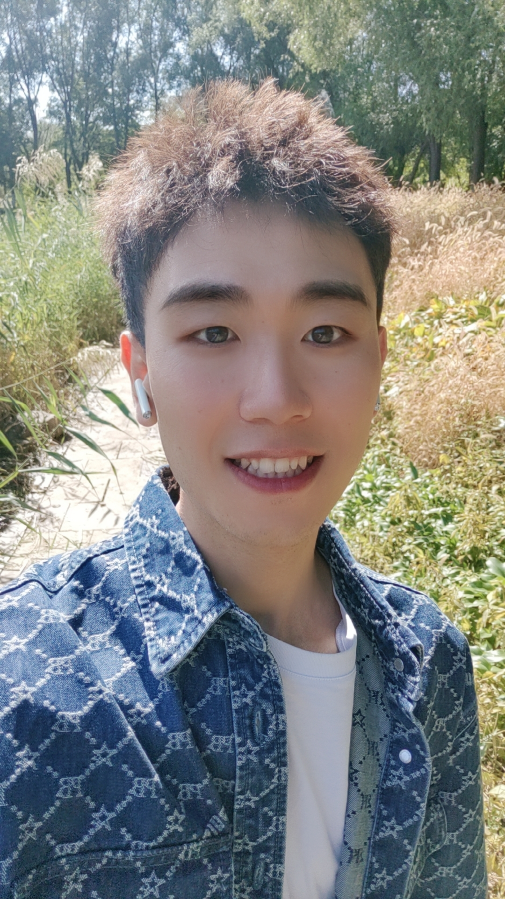

<!DOCTYPE html>
<html lang="en">
<head>
  <meta charset="UTF-8">
  <meta name="viewport" content="width=device-width, initial-scale=1">
  <title>He Kong | Homepage</title>
  <link href="https://fonts.googleapis.com/css2?family=Roboto:wght@400;700&display=swap" rel="stylesheet">
  
</head>
<body>
  

    <header>
      
      <h1>He Kong</h1>
      
Ph.D. Candidate in Artificial Intelligence, Jilin University

    </header>

    <section>
      <h2>About Me</h2>
      
Hello! I am <strong>He Kong</strong>, a Ph.D. Candidate at the School of Artificial Intelligence, Jilin University. My research focuses on multi-agent reinforcement learning and LLM-based agent collaboration.

    </section>

    <section>
      <h2>Education</h2>
      <ul>
        <li><strong>Ph.D. in Artificial Intelligence</strong>, Jilin University, 2024–Present</li>
        <li><strong>M.Sc. in Computer Application Technology</strong>, Jilin University, 2019–2022</li>
        <li><strong>B.Sc. in Software Engineering</strong>, Qufu Normal University, 2015–2019</li>
      </ul>
    </section>

    <section>
      <h2>Publications</h2>
      
<a href="https://doi.org/10.1109/TITS.2025.3562302">ADAC: Actor-Double-attention-critic...</a>, IEEE TITS, 2025

      
<a href="https://doi.org/10.1016/j.patcog.2023.109473">Flexible model weighting...</a>, Pattern Recognition, 2023

      
<a href="https://doi.org/10.1007/s10489-020-02064-w">Averaged tree-augmented...</a>, Applied Intelligence, 2021

      
<a href="#">Learn to Explain Transformer...</a>, Neural Networks, 2025

      
<a href="https://github.com/niuzaisheng/ScreenAgent">ScreenAgent: A vision-language...</a>, IJCAI 2024

      
<a href="https://doi.org/10.1007/s10489-020-02064-w">From undirected dependence...</a>, Intelligent Data Analysis, 2022

    </section>

    <section>
      <h2>Projects</h2>
      <ul>
        <li><strong>[XXXXXX]</strong> – Protected projects & team collaboration</li>
      </ul>
    </section>

    <section>
      <h2>Representative Awards</h2>
      <ul>
        <li><strong>Graduate National Scholarship</strong>, 2021</li>
        <li><strong>Huawei Scholarship</strong>, 2020</li>
        <li><strong>National Endeavor Fellowship</strong>, 2017 & 2018</li>
      </ul>
    </section>

    <section class="contact">
      <h2>Contact Me</h2>
      
<strong>Email:</strong> konghe19@mails.jlu.edu.cn / konghe24@mails.jlu.edu.cn

      
<strong>GitHub:</strong> <a href="https://github.com/CrazyBayes">CrazyBayes</a>

    </section>

    <footer>
      &copy; 2024 He Kong. All rights reserved.
    </footer>
  

</body>
</html>
